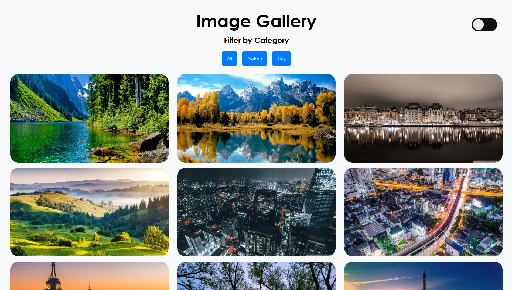
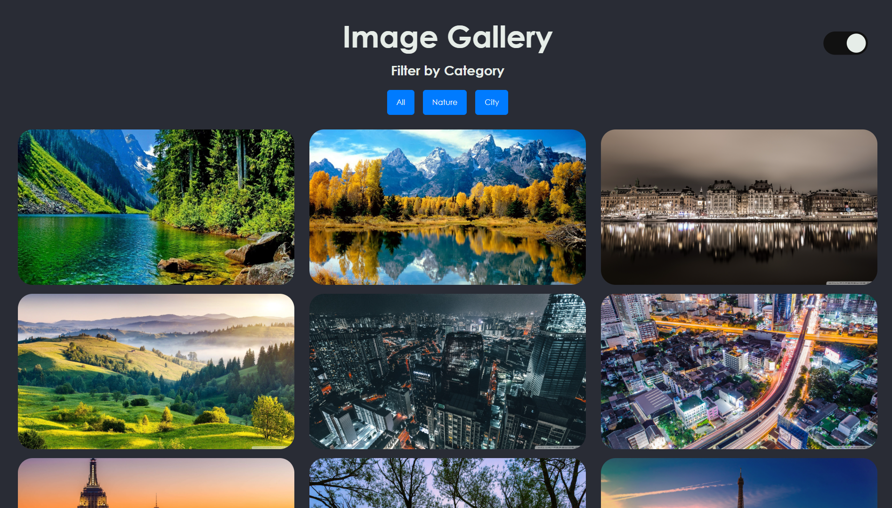
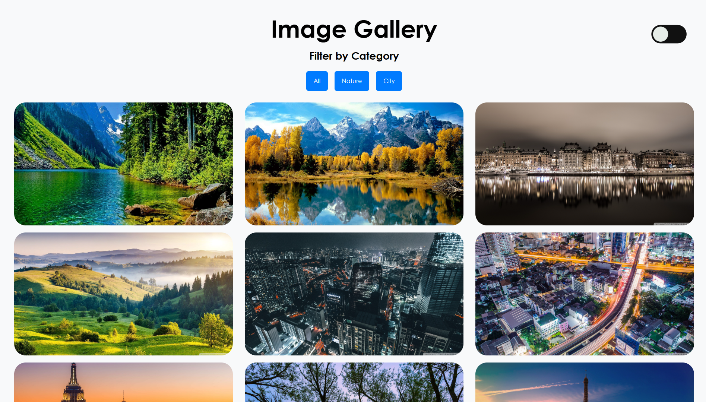

# CodeAlpha_Tasks

## TASK 1: Image Gallery

This is a responsive **Image Gallery** web application built using **HTML**, **CSS**, and **JavaScript**. The project allows users to view images categorized by type and filter them accordingly. It features smooth transitions, hover effects, and a clean, modern user interface. This project was developed as a part of the **CodeAlpha Frontend Internship**.

### Features

- Filter images based on predefined categories (e.g., Nature, Architecture, People, etc.).
- Fully responsive layout that adapts to different screen sizes.
- Enhances user interaction and visual appeal.
- Pure HTML, CSS, and JavaScript – no external frameworks or libraries used.

---

## TASK 4: Music Player using Javascript

A sleek and responsive music player built using **HTML**, **CSS**, and **JavaScript**, with features like dark/light themes, shuffle mode, time tracking, and smooth UI animations.

### Features

- Play/Pause/Next/Previous functionality
- Shuffle mode (random play)
- Displays album cover (per song)
- Light/Dark theme toggle
- Current time and duration display
- Interactive progress bar with seeking
- Organized file-based song management
- Responsive and animated UI

